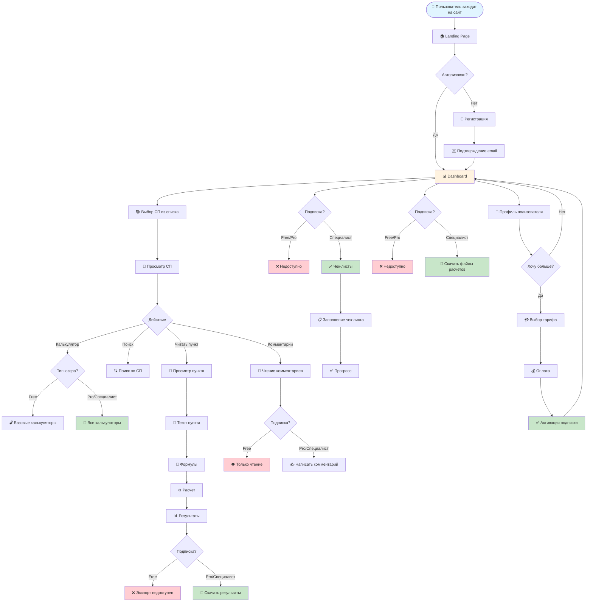

# User Flow - КАРКАС

Это пошаговая инструкция действий для реализации проекта.

## Диаграмма User Flow



## Как использовать эту диаграмму

### Вариант 1: Онлайн редактор Mermaid Live
1. Откройте https://mermaid.live
2. Скопируйте код выше (без ```)
3. Вставьте в редактор
4. Увеличивайте масштаб колесиком мыши
5. Экспортируйте: кнопка "Actions" → Export as SVG/PNG/PDF

### Вариант 2: VS Code с расширением
1. Установите расширение "Markdown Preview Mermaid Support"
2. Откройте этот файл
3. Нажмите Ctrl+Shift+V (Preview)
4. Увеличивайте Ctrl + колесико мыши

### Вариант 3: Online SVG Editor
1. Экспортируйте из Mermaid Live как SVG
2. Откройте в https://www.figma.com или https://excalidraw.com
3. Редактируйте и масштабируйте

## Пошаговый план реализации

### Этап 1: MVP (1 месяц)
- [ ] Landing Page
- [ ] Регистрация/Авторизация (Supabase)
- [ ] Dashboard с списком СП
- [ ] Просмотр пунктов СП
- [ ] Базовые калькуляторы (5 шт)
- [ ] Комментарии (чтение)

### Этап 2: Монетизация (2 недели)
- [ ] Интеграция платежей (ЮKassa)
- [ ] Тарифные планы (Free/Pro/Специалист)
- [ ] Экспорт результатов (PDF)
- [ ] Комментарии (запись для Pro)

### Этап 3: Premium Features (1 месяц)
- [ ] Чек-листы для Специалиста
- [ ] Файлы расчетов (Lira, SCAD)
- [ ] Dynamo скрипты
- [ ] Приоритетная поддержка

### Этап 4: Рост (постоянно)
- [ ] SEO оптимизация
- [ ] Контент-маркетинг
- [ ] Partnership с учебными центрами
- [ ] Реферальная программа
